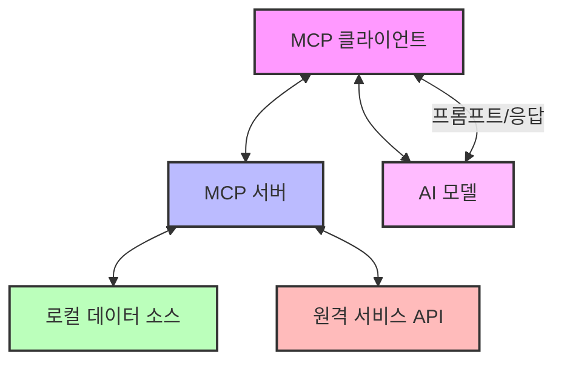
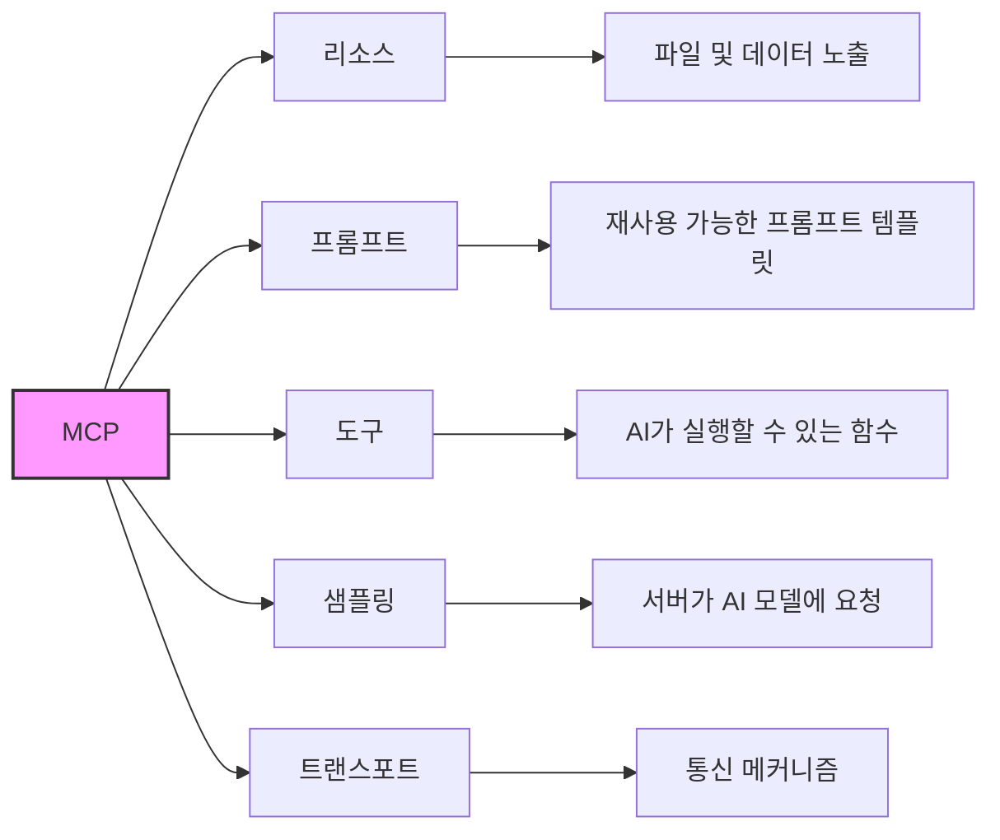
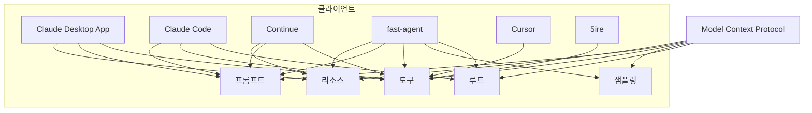
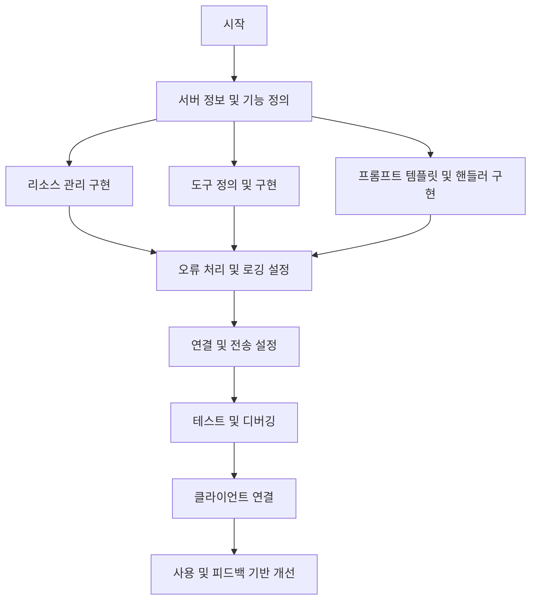

# Model Context Protocol (MCP) 요약

Model Context Protocol(MCP)은 AI 모델이 외부 데이터 소스, 도구 및 기능과 상호 작용할 수 있게 해주는 표준화된 통신 프로토콜입니다.

## MCP 아키텍처



## 핵심 구성 요소

1. **MCP 호스트**: Claude Desktop, IDE 또는 MCP를 통해 데이터에 접근하려는 AI 도구 프로그램
2. **MCP 클라이언트**: 서버와 1:1 연결을 유지하는 프로토콜 클라이언트
3. **MCP 서버**: 표준화된 Model Context Protocol을 통해 특정 기능을 노출하는 경량 프로그램
4. **로컬 데이터 소스**: MCP 서버가 안전하게 접근할 수 있는 컴퓨터의 파일, 데이터베이스 및 서비스
5. **원격 서비스**: MCP 서버가 연결할 수 있는 인터넷을 통해 사용 가능한 외부 시스템(예: API)

## MCP 주요 기능



### 1. 리소스 (Resources)
- 서버에서 AI 모델로 데이터와 콘텐츠를 노출
- 로컬 파일, 데이터베이스, API를 AI에 안전하게 접근 제공

### 2. 프롬프트 (Prompts)
- 재사용 가능한 프롬프트 템플릿과 워크플로우 제공
- 특정 작업이나 역할에 최적화된 사전 정의된 프롬프트 사용 가능

### 3. 도구 (Tools)
- AI 모델이 서버를 통해 작업을 수행할 수 있는 기능
- 외부 API 호출, 데이터 처리, 파일 조작 등 다양한 기능 가능

### 4. 샘플링 (Sampling)
- 서버가 AI 모델에 완성(completion) 요청 가능
- 서버가 지능적인 처리를 위해 AI 모델 활용 가능

### 5. 트랜스포트 (Transports)
- MCP의 통신 메커니즘
- 클라이언트와 서버 간의 데이터 교환 방식 정의

## 클라이언트 지원 현황



## Claude Desktop 설정 방법

1. Claude Desktop 설치 ([다운로드 링크](https://claude.ai/download))
2. 설정 파일 생성 또는 수정:
   - macOS/Linux: `~/Library/Application Support/Claude/claude_desktop_config.json`
   - Windows: `%AppData%\Claude\claude_desktop_config.json`

3. MCP 서버 설정 예시:
```json
{
    "mcpServers": {
        "ai-tutor": {
            "command": "python",
            "args": [
                "app.py"
            ],
            "cwd": "/절대/경로/ai-tutor-mcp"
        }
    }
}
```

## MCP 서버 개발



### 개발 권장 사항:
1. 복잡한 서버는 작은 부분으로 나누기
2. 다음 단계로 넘어가기 전에 각 구성 요소 철저히 테스트
3. 보안 고려 - 입력 검증 및 적절한 접근 제한
4. 코드 문서화
5. MCP 프로토콜 사양 준수

## 도구 예시: AI 계산기
```javascript
var calculatorTool = new McpServerFeatures.AsyncToolSpecification(
    new Tool("ai-calculator", "Performs calculations using AI", schema),
    (exchange, arguments) -> {
        // 클라이언트가 샘플링을 지원하는지 확인
        if (exchange.getClientCapabilities().sampling() == null) {
            return Mono.just(new CallToolResult("Client does not support AI capabilities", false));
        }
        
        // 샘플링 요청 생성
        McpSchema.CreateMessageRequest request = McpSchema.CreateMessageRequest.builder()
            .content(new McpSchema.TextContent("Calculate: " + arguments.get("expression")))
            .modelPreferences(McpSchema.ModelPreferences.builder()
                .hints(List.of(
                    McpSchema.ModelHint.of("claude-3-sonnet"),
                    McpSchema.ModelHint.of("claude")
                ))
                .intelligencePriority(0.8)  // 지능 우선
                .speedPriority(0.5)         // 중간 속도 중요도
                .build())
            .systemPrompt("You are a helpful calculator assistant. Provide only the numerical answer.")
            .maxTokens(100)
            .build();
        
        // 클라이언트에 샘플링 요청
        return exchange.createMessage(request)
            .map(result -> {
                // 결과 처리
                String answer = result.content().text();
                return new CallToolResult(answer, false);
            });
    }
);

// 서버에 도구 추가
server.addTool(calculatorTool)
    .subscribe();
```

## AI를 활용한 MCP 개발

1. 기능부터 시작하여 점진적으로 기능 추가
2. LLM에게 이해하지 못하는 코드 부분 설명 요청
3. 필요에 따라 수정 또는 개선 요청
4. 서버 테스트 및 엣지 케이스 처리 지원 요청 