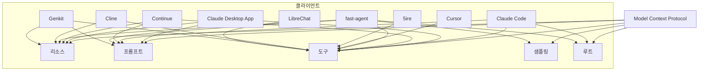

# Model Context Protocol (MCP) 종합 요약

Model Context Protocol(MCP)은 AI 모델이 외부 데이터 소스, 도구 및 기능과 상호 작용할 수 있게 해주는 표준화된 통신 프로토콜입니다. 이 프로토콜은 AI 시스템과 다양한 외부 도구 및 데이터 소스 간의 원활한 통합을 가능하게 합니다.

## MCP 아키텍처


## 핵심 구성 요소

1. **MCP 호스트**: Claude Desktop, IDE 또는 MCP를 통해 데이터에 접근하려는 AI 도구 프로그램
2. **MCP 클라이언트**: 서버와 1:1 연결을 유지하는 프로토콜 클라이언트
3. **MCP 서버**: 표준화된 Model Context Protocol을 통해 특정 기능을 노출하는 경량 프로그램
4. **로컬 데이터 소스**: MCP 서버가 안전하게 접근할 수 있는 컴퓨터의 파일, 데이터베이스 및 서비스
5. **원격 서비스**: MCP 서버가 연결할 수 있는 인터넷을 통해 사용 가능한 외부 시스템(예: API)

## MCP 주요 기능


### 1. 리소스 (Resources)
- 서버에서 AI 모델로 데이터와 콘텐츠를 노출
- 로컬 파일, 데이터베이스, API를 AI에 안전하게 접근 제공
- 다양한 리소스 유형 지원: 텍스트, 이미지, 바이너리 데이터 등
- 리소스 캐싱 및 버전 관리 기능

**리소스 구현 예시:**
```javascript
// 파일 리소스 노출 예시
const fileResource = new Resource({
  id: "example-file",
  type: "file",
  metadata: {
    name: "example.txt",
    size: 1024,
    mimeType: "text/plain"
  },
  content: fs.readFileSync("path/to/file.txt")
});

// 리소스 서버에 등록
server.registerResource(fileResource);
```

### 2. 프롬프트 (Prompts)
- 재사용 가능한 프롬프트 템플릿과 워크플로우 제공
- 특정 작업이나 역할에 최적화된 사전 정의된 프롬프트 사용 가능
- 프롬프트 매개변수화 지원
- 프롬프트 체인 및 복합 프롬프트 구성 기능

**프롬프트 구현 예시:**
```python
# 파라미터화된 프롬프트 정의
prompt_template = {
    "id": "math-tutor",
    "name": "수학 튜터",
    "description": "수학 문제 해결 안내",
    "parameters": {
        "difficulty": {
            "type": "string",
            "enum": ["초급", "중급", "고급"],
            "description": "문제의 난이도"
        },
        "topic": {
            "type": "string",
            "description": "수학 주제 (예: 대수학, 기하학, 미적분)"
        }
    },
    "template": "당신은 {difficulty} 수준의 {topic} 전문가입니다. 학생들이 문제를 단계별로 이해할 수 있도록 도와주세요."
}

# 프롬프트 서버에 등록
server.register_prompt(prompt_template)
```

### 3. 도구 (Tools)
- AI 모델이 서버를 통해 작업을 수행할 수 있는 기능
- 외부 API 호출, 데이터 처리, 파일 조작 등 다양한 기능 가능
- 동기 및 비동기 도구 지원
- 파라미터 검증 및 에러 처리 메커니즘

**도구 구현 예시:**
```typescript
// 날씨 정보 조회 도구
const weatherTool = {
  name: "get_weather",
  description: "특정 도시의 현재 날씨 정보를 가져옵니다",
  parameters: {
    type: "object",
    properties: {
      city: {
        type: "string",
        description: "날씨를 조회할 도시 이름"
      },
      units: {
        type: "string",
        enum: ["metric", "imperial"],
        description: "온도 단위 (미터법 또는 야드파운드법)",
        default: "metric"
      }
    },
    required: ["city"]
  },
  async handler(params) {
    const { city, units = "metric" } = params;
    try {
      const response = await fetch(
        `https://api.weather.com/data?city=${encodeURIComponent(city)}&units=${units}`
      );
      const data = await response.json();
      return {
        temperature: data.temp,
        conditions: data.conditions,
        humidity: data.humidity
      };
    } catch (error) {
      throw new Error(`날씨 정보를 가져오는 중 오류 발생: ${error.message}`);
    }
  }
};

// 도구 서버에 등록
server.registerTool(weatherTool);
```

### 4. 샘플링 (Sampling)
- 서버가 AI 모델에 완성(completion) 요청 가능
- 서버가 지능적인 처리를 위해 AI 모델 활용 가능
- 다양한 매개변수 제어: 온도, 토큰 수, 모델 선택 등
- 결과 스트리밍 및 비동기 처리 지원

**샘플링 구현 예시:**
```javascript
// AI 모델에 샘플링 요청
const samplingRequest = McpSchema.CreateMessageRequest.builder()
  .content(new McpSchema.TextContent("텍스트 요약: " + longText))
  .modelPreferences(McpSchema.ModelPreferences.builder()
    .hints(List.of(
      McpSchema.ModelHint.of("claude-3-opus"),
      McpSchema.ModelHint.of("claude-3-sonnet")
    ))
    .intelligencePriority(0.9)
    .speedPriority(0.3)
    .build())
  .systemPrompt("당신은 장문의 텍스트를 간결하고 정확하게 요약하는 전문가입니다.")
  .maxTokens(500)
  .build();

// 클라이언트에 샘플링 요청 및 응답 처리
exchange.createMessage(samplingRequest)
  .map(result => {
    const summary = result.content().text();
    return new CallToolResult(summary, false);
  })
  .subscribe();
```

### 5. 트랜스포트 (Transports)
- MCP의 통신 메커니즘
- 클라이언트와 서버 간의 데이터 교환 방식 정의
- 다양한 트랜스포트 계층 지원: HTTP, WebSocket, 표준 입출력(stdio) 등
- 보안 및 인증 기능

**트랜스포트 구현 예시:**
```java
// HTTP 트랜스포트 설정
HttpTransport httpTransport = new HttpTransport.Builder()
  .port(8080)
  .cors(true)
  .build();

// WebSocket 트랜스포트 설정
WebSocketTransport wsTransport = new WebSocketTransport.Builder()
  .port(8081)
  .build();

// 표준 입출력 트랜스포트 설정
StdioTransport stdioTransport = new StdioTransport();

// 서버에 트랜스포트 등록
server.withTransport(httpTransport)
      .withTransport(wsTransport)
      .withTransport(stdioTransport)
      .start();
```

## 클라이언트 지원 현황



## 지원되는 언어 및 SDK

MCP는 다양한 프로그래밍 언어로 구현할 수 있습니다:

### TypeScript/JavaScript SDK
- 웹 기반 애플리케이션에 적합
- Node.js 환경에서 사용 가능
- 브라우저 및 서버 측 구현 모두 지원

```typescript
import { McpServer, Tool, Resource } from '@mcp/typescript-sdk';

const server = new McpServer({
  name: "example-server",
  version: "1.0.0",
  description: "Example MCP server"
});

// 서버 구성 및 시작
server.start();
```

### Python SDK
- 데이터 과학 및 머신러닝 워크플로우에 통합 용이
- 비동기 처리 지원
- 다양한 프레임워크와 호환 (Flask, FastAPI 등)

```python
from mcp.server import McpServer
from mcp.tools import Tool

server = McpServer(
    name="example-server",
    version="1.0.0",
    description="Example MCP server"
)

# 서버 구성 및 시작
server.start()
```

### Java SDK
- 엔터프라이즈 애플리케이션에 적합
- Spring 통합 지원
- 강력한 타입 안전성 및 성능 최적화

```java
import io.mcp.server.McpServer;

McpServer server = McpServer.builder()
    .name("example-server")
    .version("1.0.0")
    .description("Example MCP server")
    .build();

// 서버 구성 및 시작
server.start();
```

## Claude Desktop 설정 방법

1. Claude Desktop 설치 ([다운로드 링크](https://claude.ai/download))
2. 설정 파일 생성 또는 수정:
   - macOS/Linux: `~/Library/Application Support/Claude/claude_desktop_config.json`
   - Windows: `%AppData%\Claude\claude_desktop_config.json`

3. MCP 서버 설정 예시:
```json
{
    "mcpServers": {
        "ai-tutor": {
            "command": "python",
            "args": [
                "app.py"
            ],
            "cwd": "/절대/경로/ai-tutor-mcp"
        },
        "weather-api": {
            "command": "node",
            "args": [
                "index.js"
            ],
            "cwd": "/절대/경로/weather-api"
        },
        "database-tools": {
            "command": "java",
            "args": [
                "-jar",
                "db-tools.jar"
            ],
            "cwd": "/절대/경로/database-tools"
        }
    }
}
```

4. Claude Desktop 재시작 후 도구 아이콘(🔨)을 통해 사용 가능한 MCP 서버 확인

### 문제 해결

Claude Desktop에서 MCP 서버 연결 문제가 발생할 경우 로그 확인 방법:

```bash
# Claude 로그 확인
tail -n 20 -f ~/Library/Logs/Claude/mcp*.log
```

일반적인 문제 해결 방법:
- 서버 경로가 올바른지 확인
- 서버 실행 권한 확인
- 포트 충돌이 없는지 확인
- 방화벽 설정 확인

## MCP 서버 개발 과정


### 개발 권장 사항:
1. 복잡한 서버는 작은 부분으로 나누기
2. 다음 단계로 넘어가기 전에 각 구성 요소 철저히 테스트
3. 보안 고려 - 입력 검증 및 적절한 접근 제한
4. 코드 문서화
5. MCP 프로토콜 사양 준수

## 고급 사용 사례 및 예제

### 1. 데이터베이스 통합

```python
# PostgreSQL 데이터베이스에 연결하는 MCP 서버
import psycopg2
from mcp.server import McpServer
from mcp.tools import Tool

# 데이터베이스 연결
conn = psycopg2.connect(
    host="localhost",
    database="example_db",
    user="user",
    password="password"
)

server = McpServer(
    name="db-server",
    version="1.0.0",
    description="Database access MCP server"
)

# 읽기 전용 SQL 쿼리 도구
@server.tool
def query_database(query: str, params: list = None):
    """SQL 쿼리를 실행하고 결과를 반환합니다 (읽기 전용)"""
    if not query.lower().startswith(("select", "show", "explain")):
        raise ValueError("읽기 전용 쿼리만 허용됩니다")
    
    cursor = conn.cursor()
    cursor.execute(query, params or [])
    columns = [desc[0] for desc in cursor.description]
    results = cursor.fetchall()
    
    return {
        "columns": columns,
        "rows": results,
        "rowCount": len(results)
    }

# 테이블 스키마 리소스
@server.resource("db-schema")
def get_db_schema():
    """데이터베이스 스키마 정보를 제공합니다"""
    cursor = conn.cursor()
    cursor.execute("""
        SELECT table_name, column_name, data_type
        FROM information_schema.columns
        WHERE table_schema = 'public'
        ORDER BY table_name, ordinal_position
    """)
    
    schema = {}
    for table, column, data_type in cursor.fetchall():
        if table not in schema:
            schema[table] = []
        schema[table].append({
            "name": column,
            "type": data_type
        })
    
    return schema

server.start()
```

### 2. 멀티모달 이미지 처리

```javascript
// 이미지 처리 및 분석을 위한 MCP 서버
const { McpServer, Tool, Resource } = require('@mcp/typescript-sdk');
const sharp = require('sharp');
const fs = require('fs');
const path = require('path');

const server = new McpServer({
  name: "image-processor",
  version: "1.0.0",
  description: "Image processing MCP server"
});

// 이미지 리사이징 도구
server.registerTool({
  name: "resize_image",
  description: "이미지를 지정된 크기로 리사이징합니다",
  parameters: {
    type: "object",
    properties: {
      imageId: {
        type: "string",
        description: "리사이징할 이미지 리소스 ID"
      },
      width: {
        type: "number",
        description: "새 너비 (픽셀)"
      },
      height: {
        type: "number",
        description: "새 높이 (픽셀)"
      },
      fit: {
        type: "string",
        enum: ["cover", "contain", "fill", "inside", "outside"],
        default: "cover",
        description: "리사이징 맞춤 방식"
      }
    },
    required: ["imageId", "width", "height"]
  },
  async handler({ imageId, width, height, fit = "cover" }) {
    const image = server.getResource(imageId);
    if (!image) {
      throw new Error(`이미지 리소스를 찾을 수 없음: ${imageId}`);
    }
    
    const resizedBuffer = await sharp(image.content)
      .resize({
        width,
        height,
        fit
      })
      .toBuffer();
    
    // 리사이징된 이미지를 새 리소스로 등록
    const newResourceId = `${imageId}-resized-${width}x${height}`;
    const newResource = new Resource({
      id: newResourceId,
      type: "image",
      metadata: {
        width,
        height,
        format: path.extname(image.metadata.filename).substr(1),
        originalImageId: imageId
      },
      content: resizedBuffer
    });
    
    server.registerResource(newResource);
    
    return {
      success: true,
      newImageId: newResourceId,
      width,
      height
    };
  }
});

// 이미지 메타데이터 추출 도구
server.registerTool({
  name: "extract_image_metadata",
  description: "이미지에서 메타데이터를 추출합니다",
  parameters: {
    type: "object",
    properties: {
      imageId: {
        type: "string",
        description: "메타데이터를 추출할 이미지 리소스 ID"
      }
    },
    required: ["imageId"]
  },
  async handler({ imageId }) {
    const image = server.getResource(imageId);
    if (!image) {
      throw new Error(`이미지 리소스를 찾을 수 없음: ${imageId}`);
    }
    
    const metadata = await sharp(image.content).metadata();
    
    return {
      width: metadata.width,
      height: metadata.height,
      format: metadata.format,
      space: metadata.space,
      channels: metadata.channels,
      depth: metadata.depth,
      density: metadata.density,
      hasAlpha: metadata.hasAlpha,
      hasProfile: metadata.hasProfile,
      isProgressive: metadata.isProgressive
    };
  }
});

server.start();
```

### 3. AI 튜터 시스템

```python
# AI 튜터링 시스템을 위한 MCP 서버
from flask import Flask, request, jsonify
from flask_cors import CORS
import json
import os
import logging
from mcp.server import McpServer

# MCP 서버 설정
server = McpServer(
    name="ai-tutor",
    version="1.0.0",
    description="AI Tutor MCP Server"
)

# 학습 자료 데이터베이스 (간단한 예시)
learning_materials = {
    "math": {
        "algebra": "대수학 기본 개념...",
        "calculus": "미적분학 소개...",
        "geometry": "기하학 원리..."
    },
    "programming": {
        "python": "파이썬 기초...",
        "javascript": "자바스크립트 입문...",
        "algorithms": "알고리즘 기본 개념..."
    },
    "science": {
        "physics": "물리학 기본 법칙...",
        "chemistry": "화학 원소 및 반응...",
        "biology": "생물학 기초 개념..."
    }
}

# 학습 자료 검색 도구
@server.tool
def search_learning_materials(subject: str, topic: str = None):
    """특정 주제에 대한 학습 자료를 검색합니다"""
    if subject not in learning_materials:
        return {"error": f"'{subject}' 과목을 찾을 수 없습니다"}
    
    if topic:
        if topic not in learning_materials[subject]:
            return {"error": f"'{subject}' 과목에서 '{topic}' 주제를 찾을 수 없습니다"}
        return {
            "subject": subject,
            "topic": topic,
            "content": learning_materials[subject][topic]
        }
    else:
        return {
            "subject": subject,
            "available_topics": list(learning_materials[subject].keys())
        }

# 학습 진도 추적 도구
student_progress = {}

@server.tool
def track_student_progress(student_id: str, subject: str, topic: str, completed: bool = False, score: int = None):
    """학생의 학습 진도를 추적합니다"""
    if student_id not in student_progress:
        student_progress[student_id] = {}
    
    if subject not in student_progress[student_id]:
        student_progress[student_id][subject] = {}
    
    student_progress[student_id][subject][topic] = {
        "completed": completed,
        "score": score,
        "timestamp": datetime.now().isoformat()
    }
    
    return {
        "success": True,
        "student_id": student_id,
        "subject": subject,
        "topic": topic,
        "status": "완료" if completed else "진행 중",
        "score": score
    }

# 개인화된 튜터링 프롬프트
@server.prompt
def create_personalized_tutor_prompt(subject, difficulty, student_name):
    """학생과 과목에 맞춰진 개인화된 튜터 프롬프트 생성"""
    prompts = {
        "math": f"당신은 {student_name}님을 위한 {difficulty} 수준의 수학 튜터입니다. 문제 해결 과정을 단계별로 자세히 설명하고, 시각적인 예시를 제공하며, 학생이 스스로 답을 찾을 수 있도록 안내해주세요.",
        "programming": f"당신은 {student_name}님의 {difficulty} 수준 프로그래밍 멘토입니다. 코딩 개념을 쉽게 설명하고, 실용적인 예제를 제공하며, 문제 해결 기술을 개발할 수 있도록 지도해주세요.",
        "science": f"당신은 {student_name}님을 위한 {difficulty} 수준의 과학 교육자입니다. 과학적 개념을 명확하게 설명하고, 일상 생활의 예시를 들어 이해를 돕고, 비판적 사고와 실험적 접근을 장려해주세요."
    }
    
    return prompts.get(subject, f"당신은 {student_name}님을 위한 {difficulty} 수준의 {subject} 튜터입니다.")

server.start()
```

## 고급 기능 및 최적화

### 1. 성능 최적화 기법

- **리소스 캐싱**: 자주 액세스하는 리소스를 메모리에 캐싱하여 성능 향상
- **연결 풀링**: 데이터베이스 및 외부 API 연결을 재사용하여 오버헤드 감소
- **비동기 처리**: 블로킹 작업을 비동기적으로 처리하여 응답성 향상
- **부분 응답**: 대용량 데이터 처리 시 청크 단위로 응답하여 메모리 사용량 최적화

### 2. 보안 강화 기법

- **입력 검증**: 모든 사용자 입력에 대한 철저한 검증
- **샌드박싱**: 도구 실행을 제한된 환경에서 수행하여 시스템 보호
- **접근 제어**: 리소스 및 도구 접근에 대한 세분화된 권한 설정
- **데이터 암호화**: 민감한 데이터 암호화 및 안전한 처리
- **감사 로깅**: 모든 작업에 대한 상세 로그 기록

### 3. 확장성 설계

- **마이크로서비스 아키텍처**: 기능별로 독립적인 MCP 서버 구성
- **로드 밸런싱**: 부하 분산을 통한 처리 능력 향상
- **수평적 확장**: 필요에 따라 서버 인스턴스 추가
- **큐 기반 처리**: 장시간 실행 작업을 위한 비동기 작업 큐 구현

## 도구 예시: AI 계산기
```javascript
var calculatorTool = new McpServerFeatures.AsyncToolSpecification(
    new Tool("ai-calculator", "Performs calculations using AI", schema),
    (exchange, arguments) -> {
        // 클라이언트가 샘플링을 지원하는지 확인
        if (exchange.getClientCapabilities().sampling() == null) {
            return Mono.just(new CallToolResult("Client does not support AI capabilities", false));
        }
        
        // 샘플링 요청 생성
        McpSchema.CreateMessageRequest request = McpSchema.CreateMessageRequest.builder()
            .content(new McpSchema.TextContent("Calculate: " + arguments.get("expression")))
            .modelPreferences(McpSchema.ModelPreferences.builder()
                .hints(List.of(
                    McpSchema.ModelHint.of("claude-3-sonnet"),
                    McpSchema.ModelHint.of("claude")
                ))
                .intelligencePriority(0.8)  // 지능 우선
                .speedPriority(0.5)         // 중간 속도 중요도
                .build())
            .systemPrompt("You are a helpful calculator assistant. Provide only the numerical answer.")
            .maxTokens(100)
            .build();
        
        // 클라이언트에 샘플링 요청
        return exchange.createMessage(request)
            .map(result -> {
                // 결과 처리
                String answer = result.content().text();
                return new CallToolResult(answer, false);
            });
    }
);

// 서버에 도구 추가
server.addTool(calculatorTool)
    .subscribe();
```

## AI를 활용한 MCP 개발

1. 기능부터 시작하여 점진적으로 기능 추가
2. LLM에게 이해하지 못하는 코드 부분 설명 요청
3. 필요에 따라 수정 또는 개선 요청
4. 서버 테스트 및 엣지 케이스 처리 지원 요청

## MCP의 미래 발전 방향

1. **더 강력한 멀티모달 지원**: 다양한 데이터 형식(이미지, 오디오, 비디오 등)에 대한 향상된 처리 기능
2. **표준화 및 상호 운용성**: 다양한 AI 모델 및 플랫폼 간의 호환성 강화
3. **실시간 협업**: 여러 AI 모델 및 사용자 간의 협업 기능 향상
4. **디바이스 간 동기화**: 다양한 기기에서 MCP 기능 접근 및 상태 유지
5. **더 풍부한 에코시스템**: 더 많은 도구, 플러그인, 확장 기능 개발

## 커뮤니티 및 자원

- **공식 문서**: [Model Context Protocol 문서](https://modelcontextprotocol.io/)
- **GitHub 저장소**:
  - [TypeScript SDK](https://github.com/modelcontextprotocol/typescript-sdk)
  - [Python SDK](https://github.com/modelcontextprotocol/python-sdk)
- **커뮤니티 포럼**: 개발자 토론 및 지원
- **샘플 프로젝트**: 다양한 사용 사례를 위한 예제 코드
- **튜토리얼 및 가이드**: 단계별 개발 안내 